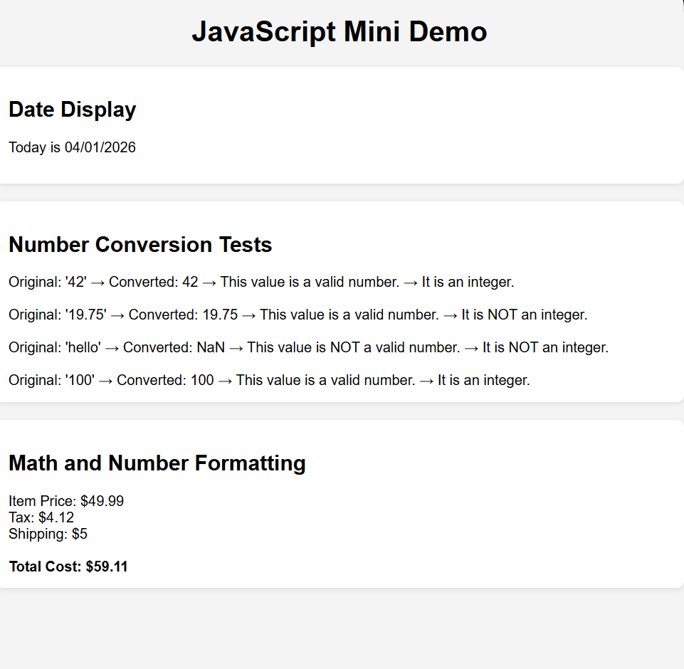

# JavaScript Mini Demo

## Live Website
GitHub Pages Link:  
https://nightsu32.github.io/comp484-hw9/

---

## Built-In Objects and Methods Used

### Date Object
- `new Date()`
- `getMonth()`
- `getDate()`
- `getFullYear()`

### Number Object
- `Number()`
- `Number.isNaN()`
- `Number.isInteger()`

### Number Formatting
- `toFixed()`

### DOM Manipulation
- `document.getElementById()`
- `.textContent`
- `.innerHTML`

---

## Screenshot

---

## Reflection

The easiest part of this assignment was performing the math calculations and displaying the results because it mainly involved basic arithmetic and string formatting. The hardest part was formatting the date correctly, especially remembering that JavaScript months are zero-based and need to be adjusted. I learned that the `Date` object requires careful handling to properly format values like month and day with leading zeros. I also learned how the `Number` object can convert strings into numbers and how methods like `Number.isNaN()` and `Number.isInteger()` help validate data. Overall, I learned how to use JavaScript to dynamically display results on a webpage instead of just printing to the console.